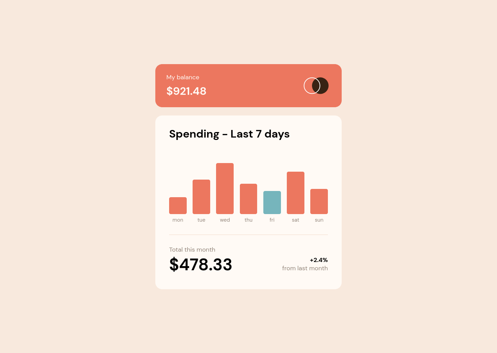

# Frontend Mentor - Expenses chart component solution

This is a solution to the [Expenses chart component challenge on Frontend Mentor](https://www.frontendmentor.io/challenges/expenses-chart-component-e7yJBUdjwt). Frontend Mentor challenges help you improve your coding skills by building realistic projects.

## Table of contents

- [Overview](#overview)
  - [The challenge](#the-challenge)
  - [Screenshot](#screenshot)
  - [Links](#links)
- [My process](#my-process)
  - [Built with](#built-with)
  - [What I learned](#what-i-learned)
- [Author](#author)

## Overview

### The challenge

Users should be able to:

- View the bar chart and hover over the individual bars to see the correct amounts for each day
- See the current day’s bar highlighted in a different colour to the other bars
- View the optimal layout for the content depending on their device’s screen size
- See hover states for all interactive elements on the page
- **Bonus**: Use the JSON data file provided to dynamically size the bars on the chart

### Screenshot

### Links

- Solution URL: [https://github.com/rizzok/fem-sunnyside-agency-landing-page](https://github.com/rizzok/fem-sunnyside-agency-landing-page)
- Live Site URL: [https://fem-expenses-chart-component-main.vercel.app/](https://fem-expenses-chart-component-main.vercel.app/)

## My process

### Built with

- [React](https://reactjs.org/)
- [Vite](https://vitejs.dev/)
- [Emotion](https://emotion.sh/)

### What I learned

Create a project with Vite and Emotion, and deploy it on Vercel.

## Author

- Website - [https://suncode.fr](https://suncode.fr)
- Frontend Mentor - [@rizzok](https://www.frontendmentor.io/profile/rizzok)
- Twitter - [@rizzokdev](https://twitter.com/rizzokdev)
